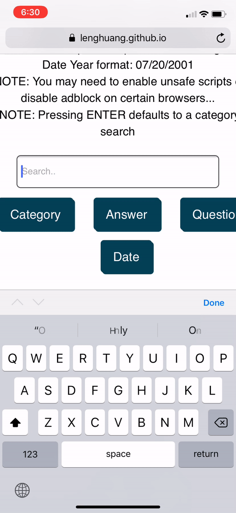

# Jeopardy Capital One Challenge

This is a search engine of Jeopardy questions (or answers...)! Input anything that you think may be remotely related to... to... I don't know, but to something, ranging from Cracker Barrel to Dancing in the Bible, you can find it. This search engine will take a potential category name, question, answer, or airdate, and search for matching categories with their questions and answers from the show Jeopardy.

Deployed Website: https://lenghuang.github.io/jeopardy-capital-one/

# My Approach

I utilized GitHub pages to host compressed versions of the jService Json data. Although I am still utilizing linear search, searching these compressed versions of data would allow me a quicker linear search time such that it becomes barely noticeable. The repository for these compressed versions can be found here: https://github.com/lenghuang/Capital_One_Data. With the compressed method, I retrieved the data to then output it into an HTML website. 

The biggest challenge for me was learning everything because this was the first time I've ever made a web app and the first time I've used JavaScript. Although I didn't have time for this challenge, I look forward to adding new features and building upon this in my own time.

# Demo

# Challenge Prompt

(Copied from Mindsumo website)

To complete this challenge, build a web application that:

has a search function that displays results in an intuitive, responsive, mobile friendly, easy to navigate interface.
gives users the ability to refine search results by: 
date or timeframe aired (you can search by a day,  a week, a month)
trivia category
level of difficulty of the question
any other smart searching criteria you see fit
Optional: You may want to include these bonus features:

Game board simulation with the categories and questions in the proper place (as it would be organized in the game with easier questions on top)
Marking or saving questions into a "favorites" collection
*Required: In your submission, you will need a link to a live deployed website (eg Heroku, Github pages, etc) and a link to your repository with code.

*API Note: The API is already implemented and deployed.  For example, to retrieve a random clue, use the /api/random endpoint hosted at http://jservice.io/api/random.

Submissions will be graded on the following criteria:
Meets Deliverables
Creativity/Aesthetics (UI/UX)
Clarity & Code Quality
